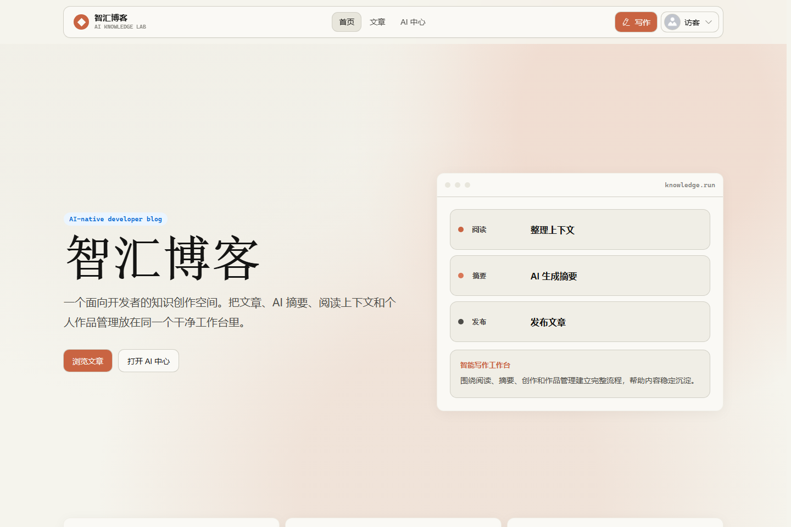
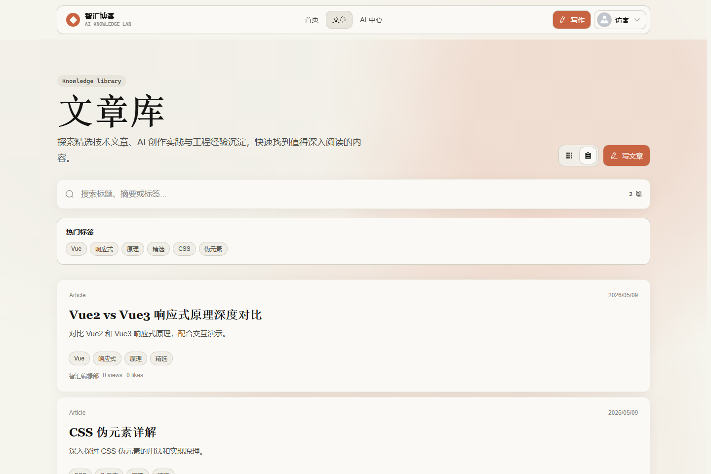
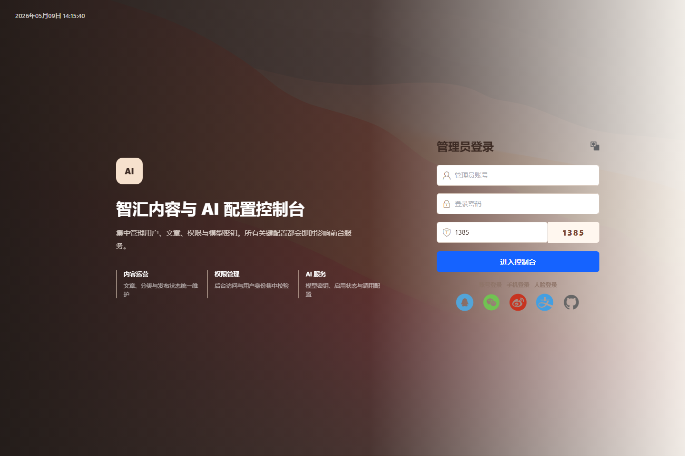

# AI-Vue3-python-flask-Blog

一个适合大学生二次开发、课程设计和毕业设计的 **Vue 3 + Python Flask + MySQL** 全栈 AI 博客系统。

本项目已经包含前台博客、后台管理、后端 API、数据库、登录鉴权、文章管理、评论收藏和基础 AI 能力。它不是一个空壳模板，而是可以直接运行、部署、演示和继续扩展的完整项目。

线上体验：[https://ai-vue3-python-flask-blog.vercel.app/](https://ai-vue3-python-flask-blog.vercel.app/)

如果这个项目对你的学习、毕设选题或二开有帮助，欢迎 Star、Fork 和使用。

## 为什么适合做毕设

`main` 分支是当前稳定版本，已经适配 Vercel 前端部署和 Railway 后端部署。对于大学生毕业设计或课程设计，它有几个比较实用的优点：

- 技术栈常见：Vue 3、Flask、MySQL、JWT、Element Plus，适合写论文和答辩说明。
- 模块完整：前台、后台、后端、数据库都有，不只是单页面 Demo。
- 功能够用：文章发布、用户登录、权限管理、评论收藏、AI 写作、图片上传等基础功能齐全。
- 易于扩展：可以继续做 AI 写作、知识库、推荐系统、数据统计、后台审核、角色权限等方向。
- 可部署演示：项目已经做过线上部署适配，适合答辩时展示真实网站。

## 页面截图

### 前台首页



### 文章库



### 管理后台登录



## 核心功能

### 用户端

- 首页展示与文章列表
- 文章详情、阅读、评论、点赞和收藏
- 用户注册、登录和个人中心
- 文章创建、编辑、发布和删除
- AI 辅助写作与 AI 对话入口

### 管理后台

- 用户管理
- 文章管理
- 角色和权限管理
- AI 模型配置
- 后台运营管理页面

### 后端 API

- JWT 登录鉴权
- 用户、文章、评论、收藏接口
- 图片上传接口
- AI 生成与对话接口
- MySQL 数据持久化

## 技术栈

### 前台 `front/`

- Vue 3
- Vite
- TypeScript
- Pinia
- Vue Router
- Element Plus

### 管理后台 `avue-cli/`

- Vue 3
- Vite
- Avue
- Element Plus
- Axios

### 后端 `backend/`

- Python Flask
- SQLAlchemy
- PyMySQL
- MySQL
- JWT
- Flask-CORS
- OpenAI-compatible API

## 项目结构

```text
AI-Vue3-python-flask-Blog/
├── front/        # 用户端前台
├── avue-cli/     # Avue 管理后台
├── backend/      # Flask 后端 API
└── README.md
```

## 本地启动

### 1. 后端

```bash
cd backend
pip install -r requirements.txt
python init_db.py
python app.py
```

默认后端地址：

```text
http://127.0.0.1:5000
```

### 2. 用户端前台

```bash
cd front
npm install
npm run dev
```

### 3. 管理后台

```bash
cd avue-cli
npm install
npm run dev
```

## 二开方向

你可以基于 `main` 分支继续扩展：

- AI 文章生成、摘要生成、标题推荐
- 后台文章审核和内容运营
- 用户等级、积分、消息通知
- 文章推荐、热门排行、搜索优化
- 数据看板和访问统计
- 文件上传、Markdown 导入、富文本增强
- 部署上线、HTTPS、数据库备份和安全加固

## 分支提示

`main` 是当前稳定的毕设/二开基础版本。

另有开发中的下一代分支 `feat/contextforge-workspace`，正在探索 **知境 ContextForge AI 知识工作台**，包含上下文包、RAG、Embedding 和更清晰的前后台边界。

开发分支说明：[知境 ContextForge 架构、群体与使用说明](https://github.com/linsk27/AI-Vue3-python-flask-Blog/blob/feat/contextforge-workspace/docs/contextforge-architecture-usage.md)
