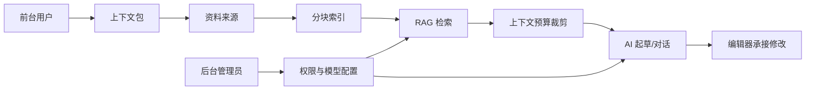

# 知镜后端与 RAG 架构健康检查

> 日期：2026-05-24  
> 范围：Flask 后端、RAG/Embedding、权限、数据库访问、前后台职责边界。  
> 原则：不改公开 API，不做破坏性数据库迁移，不回滚当前前端样式改动。

## 结论

当前系统已经具备可运行的博客、上下文包、RAG 检索、AI 起草、Embedding 配置和管理后台基础能力，但后端核心文件承担了过多职责：

- `backend/routes/ai.py` 约 1200+ 行，混合了 AI 配置、文章起草、流式对话、RAG 检索、Embedding 配置校验、响应归一化。
- `backend/routes/context_pack.py` 约 1100+ 行，混合了鉴权、表结构初始化、上下文包 CRUD、来源管理、RAG 分块、Embedding 刷新、Markdown 导出。
- 建表和轻量迁移逻辑散落在业务请求路径中，长期维护成本高。
- 旧测试多为手动脚本，缺少可重复的 pytest 基线。

本轮已先落地一个低风险加固点：把 RAG/Embedding 的纯逻辑抽到 `backend/services/rag_utils.py`，并补上 pytest 用例。公开接口和响应格式保持不变。

## 当前职责边界

### 前台 `front`

面向普通用户和内容创作者：

- 浏览、整理上下文包。
- 使用 RAG 检索预览，理解 AI 会引用哪些资料。
- 调用 AI 起草文章，再进入编辑器修改。
- 阅读、发布、管理自己的内容。

前台不应承载系统治理能力，例如用户权限分配、模型 Key 管理、数据库自检和全局内容治理。

### 后台 `avue-cli`

面向管理员和维护者：

- 用户、角色、权限治理。
- AI 模型与 Embedding 配置管理。
- 系统自检、数据库链路、内容治理和风险观察。
- 全局文章、评论、上下文包巡检。

后台页面应保持工具型、低干扰、信息密度合理，不应复制前台写作流程。

### 后端 `backend`

提供稳定 API 和业务编排：

- 认证权限：登录态解析、角色权限、资源所有者判断。
- 文章：文章 CRUD、分类、评论、点赞。
- 上下文包：包、来源、分块索引、Markdown 导出。
- RAG：关键词召回、语义召回、预算裁剪、来源引用。
- Embedding：配置校验、向量生成、索引刷新。
- AI：对话、起草、返回内容归一化。
- 系统自检：数据库、表结构、AI 配置。

## 核心链路



## 风险分级

| 等级 | 风险 | 现状 | 处理方向 |
| --- | --- | --- | --- |
| P0 | 公开 API 不稳定 | 前端已依赖 `/api/*` 响应 | 保持 `{ status, msg, data }` 不变，只做内部拆分 |
| P1 | 路由文件过大 | `ai.py`、`context_pack.py` 过长 | 路由只保留 HTTP 入参/出参，业务下沉到 service |
| P1 | 权限逻辑重复 | `middleware.py` 与 `context_pack.py` 均解析用户 | 统一权限上下文对象，保留兼容包装函数 |
| P1 | RAG 难测试 | 分块、召回、预算裁剪混在路由 | 抽纯函数并补单测，本轮已开始 |
| P2 | 建表逻辑分散 | 请求路径里存在 `CREATE TABLE` / `ALTER TABLE` | 集中到 schema/migration helper |
| P2 | AI 错误信息不稳定 | 上游异常可能直接透出 | 增加错误分类、脱敏和前端可读提示 |
| P2 | 前后台边界易混 | 前台出现部分治理入口 | 治理入口收敛到后台，前台只保留用户工作流 |

## 本轮已落地

- 2026-05-25 第四轮拆分：
  - 新增 `backend/services/ai_rag_service.py`，集中上下文包 RAG 检索、语义回退、token 预算裁剪和检索元数据组装。
  - 新增 `backend/services/ai_context_service.py`，集中 AI 对话上下文记忆、上下文包切换重置和历史裁剪。
  - `backend/routes/ai.py` 从约 1060 行继续收敛到约 810 行，保留原 `retrieve_context_pack_snippets` 和 `build_effective_system_prompt` 兼容 wrapper。
  - 新增 `backend/tests/test_ai_rag_service.py` 和 `backend/tests/test_ai_context_service.py`，覆盖关键词 RAG 回退、权限拒绝和上下文裁剪。
- 2026-05-25 第三轮拆分：
  - 新增 `backend/services/ai_article_service.py`，集中 AI 起草返回 JSON 提取、坏 JSON 修复、正文归一化。
  - 新增 `backend/services/ai_embedding_config_service.py`，集中 Embedding 配置安全输出、配置校验和无 token 成本说明。
  - `backend/routes/ai.py` 从约 1322 行收敛到约 1060 行，保留原 `/api/ai/*` 路由和函数兼容导出。
  - `backend/tests/test_ai_payloads.py` 改为直接覆盖 service，降低测试对 Flask 路由导入的耦合。
- 2026-05-25 第二轮拆分：
  - 新增 `backend/db/schema.py`，集中上下文包和 Embedding 相关建表/补字段逻辑。
  - 新增 `backend/repositories/context_pack_repo.py`，集中上下文包、来源、chunk、统计和写入 SQL。
  - 新增 `backend/services/context_pack_service.py`，承接上下文包质量分、token budget、RAG 索引、Embedding 刷新、Markdown 导出、创建/更新/删除编排。
  - `backend/routes/context_pack.py` 从约 1288 行收敛到约 496 行，保留原路由和兼容导出。
  - 新增 `backend/tests/test_context_pack_service.py`，覆盖服务层核心行为。
- 新增 `backend/services/rag_utils.py`：
  - `estimate_tokens`
  - `clamp_context_token_budget`
  - `extract_query_terms`
  - `is_pack_overview_query`
  - `normalize_source_content`
  - `split_text_into_chunks`
  - `split_source_into_chunks`
  - `score_chunk`
  - `source_weight_score`
  - `build_pack_profile`
  - `serialize_embedding`
  - `parse_embedding`
  - `cosine_similarity`
- `backend/routes/ai.py` 改为复用 service 内的 RAG 工具函数。
- `backend/routes/context_pack.py` 改为复用 service 内的分块、向量序列化和相似度函数。
- 新增后端测试基线：
  - `backend/pytest.ini`
  - `backend/requirements-dev.txt`
  - `backend/tests/test_rag_utils.py`
  - `backend/tests/test_ai_payloads.py`

## 后续拆分顺序

### 第一阶段：稳定测试面

目标：不改 API，仅让核心逻辑可测。

- RAG 工具函数单测覆盖分块、关键词、token 估算、相似度。
- AI 起草归一化覆盖纯 JSON、代码块 JSON、坏 JSON、非 JSON 文本。
- Embedding 配置校验覆盖未启用、缺模型、缺 Key、非法 base_url、完整配置。
- 权限判断覆盖访客、所有者、管理员。

验收标准：

- `cd backend && pytest` 可稳定通过。
- 新增业务逻辑优先进入 `services` 并配测试。

### 第二阶段：拆 `context_pack.py`

目标：把上下文包路由从“全能文件”拆成清晰层级。

建议结构：

```text
backend/
  routes/
    context_pack.py          # HTTP 入参/出参
  services/
    context_pack_service.py  # 上下文包业务编排
    rag_utils.py             # RAG 纯函数
    embedding_service.py     # Embedding 调用和错误分类
  repositories/
    context_pack_repo.py     # SQL 查询与写入
  db/
    schema.py                # 建表和轻量迁移
```

验收标准：

- 路由层不直接拼复杂 SQL。
- 建表和补字段逻辑不出现在普通业务函数中。
- 导出 Markdown、刷新索引、刷新 Embedding 分别有独立 service 方法。

### 第三阶段：拆 `ai.py`

目标：AI 对话、文章起草、Embedding 配置各自独立。

建议结构：

```text
backend/
  routes/
    ai.py
  services/
    ai_chat_service.py
    ai_article_service.py
    ai_config_service.py
    rag_retrieval_service.py
```

验收标准：

- AI 起草路由只负责读取参数、调用 service、返回统一响应。
- RAG 检索结果 DTO 固定，至少包含来源标题、来源编号、相关度、token 估算、回退原因。
- AI 上游异常被转换为明确错误类型，不泄露 API Key、完整请求头或底层堆栈。

### 第四阶段：权限统一

目标：减少重复 token/user/permission 解析。

建议新增内部对象：

```python
{
    "id": 1,
    "username": "admin",
    "role": "admin",
    "permissions": ["context_pack:manage"],
    "is_admin": True,
}
```

验收标准：

- 路由中不重复解析 JWT。
- 所有资源访问统一经过 `can_view_*` / `can_manage_*`。
- 前台用户只能操作自己的上下文包，管理员能力集中在后台。

## 2026-05-25 第五轮拆分：AI 配置与 Embedding 配置

本轮继续收紧 `backend/routes/ai.py`：

- 新增 `backend/repositories/ai_config_repo.py`，集中 `ai_configs` 与 `ai_embedding_configs` 的 SQL。
- 新增 `backend/services/ai_config_service.py`，负责启用模型配置、配置列表脱敏、创建、更新、删除、激活。
- 扩展 `backend/services/ai_embedding_config_service.py`，把 Embedding 配置读取、保存、草稿校验从路由层移出。
- `backend/db/schema.py` 新增 `ensure_ai_config_table`，普通业务路由不再直接散落 `CREATE TABLE`。
- `backend/routes/ai.py` 保持原有 HTTP 路径和 `{ status, msg, data }` 响应格式，只负责参数读取和返回。

当前结果：

- `ai.py` 从上一轮约 810 行继续降到约 590 行。
- AI 配置 API、Embedding 配置 API 对前端保持兼容。
- API Key 只在服务层脱敏后返回，路由不再手写脱敏逻辑。
- 后续还可以继续拆 `chat/chat_stream/generate_article`，把 OpenAI 调用和流式响应编排下沉到 `services.ai_chat_service`。

## RAG/Embedding 契约

无 Embedding 配置时：

- 只走关键词检索。
- 返回明确回退原因，例如 `embedding_not_configured`。
- 前端不应显示“语义检索已生效”，而应显示“当前为关键词检索”。

Embedding 已配置但索引不完整时：

- 当前模型已向量化的 chunk 可参与语义召回。
- 未向量化或旧模型 chunk 继续走关键词召回。
- 返回 `no_current_model_embeddings` 或 `stale_embedding_chunks` 等原因。

RAG 命中片段至少包含：

```json
{
  "source_id": 1,
  "source_title": "资料标题",
  "chunk_id": 10,
  "chunk_index": 0,
  "content": "命中文本",
  "score": 12.4,
  "tokens_estimate": 180,
  "retrieval_mode": "keyword|semantic|hybrid",
  "fallback_reason": ""
}
```

## 工具链建议

当前选择轻量方案：

- `pytest`：后端单测。
- `ruff`：新代码和被拆分模块的基础静态检查。

暂不引入：

- Alembic：当前先保持轻量建表/补字段，等 schema 稳定后再迁移。
- 大型后端框架重写：当前 Flask 已能承载项目，重写成本不值得。

## 验收命令

```bash
cd backend
pip install -r requirements-dev.txt
pytest
python -m ruff check services tests
```

前端和后台构建：

```bash
cd front && npm run build
cd avue-cli && npm run build
```
