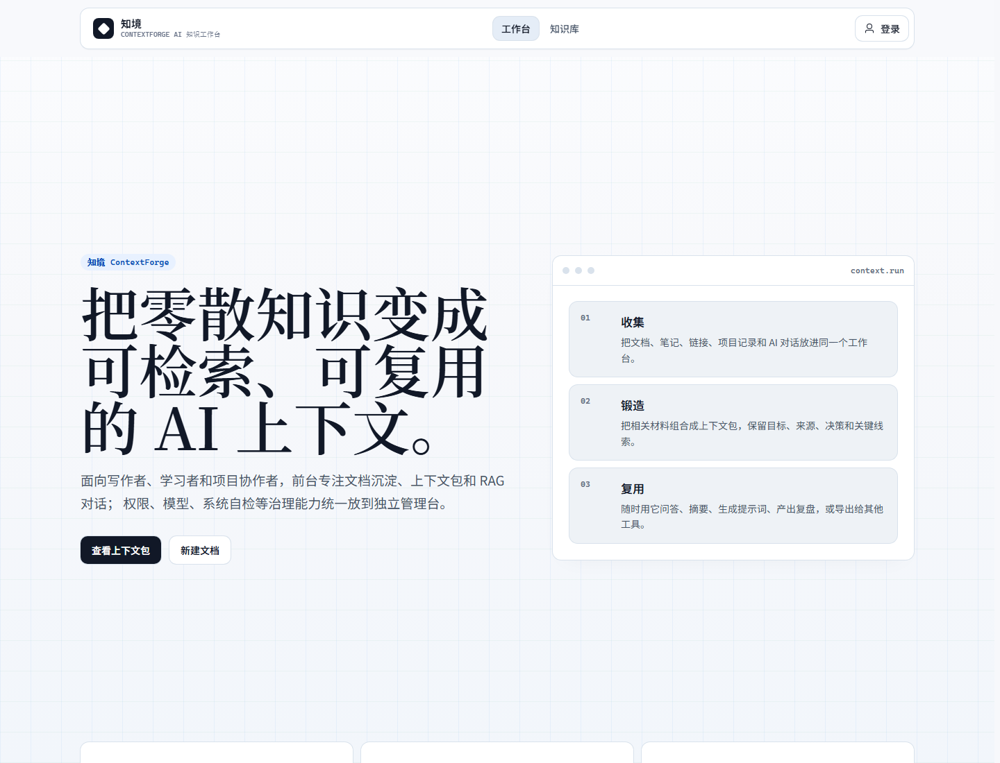
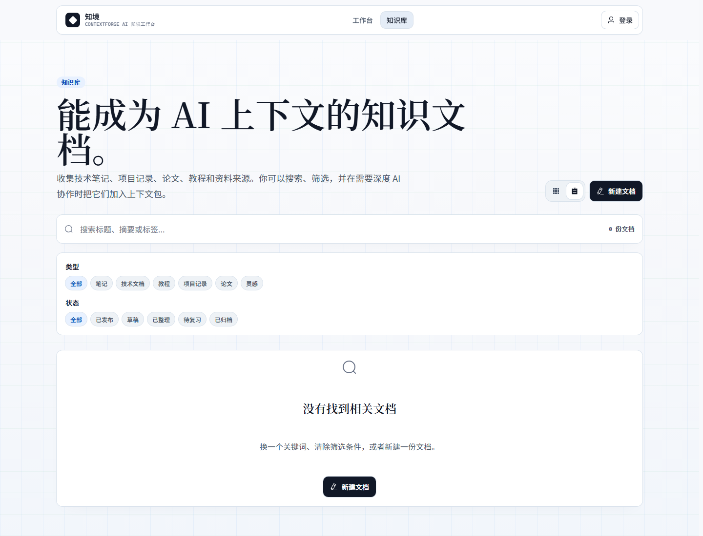
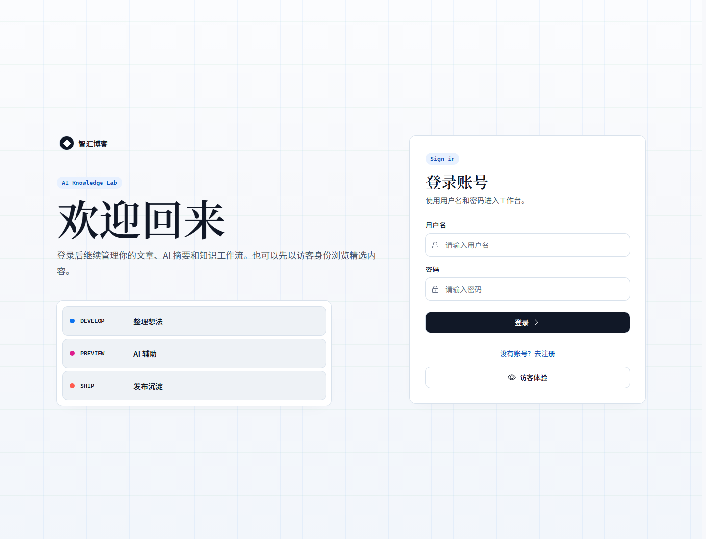
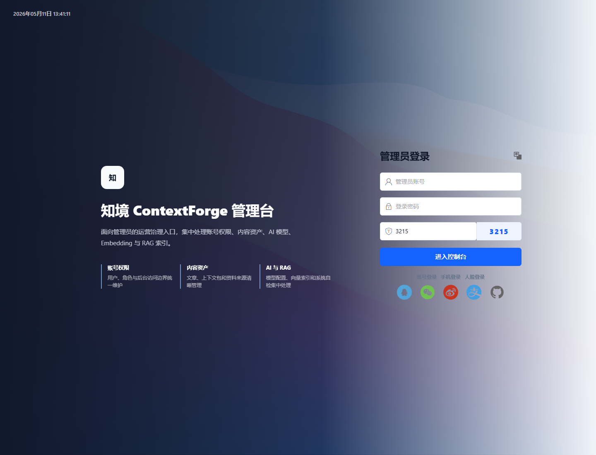

# 知境 ContextForge 架构、用户边界与使用说明

本文对应 `feat/contextforge-workspace` 开发分支。这个分支的目标不是继续堆博客功能，而是把项目升级为一个可以沉淀资料、组织上下文、低成本接入 AI 的知识工作台。

## 1. 产品定位

知境 ContextForge 面向个人学习、毕业设计开发、写作者和小团队知识整理场景。它把文档、资料来源、上下文包、RAG 检索、AI 对话和 AI 起草组织成一个闭环。

核心流程：

```text
写下真实内容
  -> 组织成上下文包
  -> 构建 RAG 分块索引
  -> 检索命中相关片段
  -> AI 基于少量片段回答或起草
  -> 新内容继续沉淀回知识库
```

这个设计的价值在于：不把整份资料塞进提示词，而是先检索，再把少量相关片段交给 AI。这样更省 token，也更容易判断 AI 的回答依据。

## 2. 页面截图

### 工作台首页



### 知识库列表



### 前台登录与 AI 工作台入口



### 独立管理后台



## 3. 面向用户群体

### 访客

访客只能浏览公开且已发布的知识文档。访客不能进入 AI 工作台，也不能维护上下文包。

### 普通用户

普通用户是主要创作者，可以：

- 写自己的知识文档。
- 收藏、评论、管理自己的作品。
- 创建和维护自己的上下文包。
- 在 AI 对话或 AI 起草中选择自己可访问的上下文包。

### 知识维护者

知识维护者适合小团队场景。拥有 `context_pack:manage` 权限后，可以维护指定上下文资产，包括资料来源、RAG 分块索引和 Markdown 导出。

### 管理员

管理员负责系统治理，可以：

- 管理用户、角色和权限。
- 管理全站文章和上下文包。
- 配置 AI 聊天模型和 Embedding 模型。
- 在独立 Avue 管理台查看真实数据概览和系统自检。

边界原则：普通用户维护自己的内容，知识维护者维护上下文资产，管理员维护系统。这样可以避免“谁都能往上下文包里乱加文件”的混乱。

## 4. 整体架构

```text
front/
  Vue 3 + Vite + TypeScript
  Pinia 状态管理
  Vue Router 路由守卫
  Element Plus UI
  Quill 编辑器
  Marked / Highlight / Mammoth 文档处理
  面向普通用户的知识工作台

avue-cli/
  Avue + Vue 3 + Vite
  Element Plus 管理组件
  用户、角色、内容、AI、Embedding、RAG、系统自检
  面向管理员和运营者的后台

backend/
  Flask 蓝图路由
  SQLAlchemy + PyMySQL
  JWT 鉴权
  权限中间件
  AI Chat / Article Draft
  Context Pack / RAG / Embedding

MySQL
  用户、角色、权限
  文档、评论、收藏
  AI 配置、Embedding 配置
  上下文包、资料来源、RAG 分块
```

请求链路：

```text
Vue 页面
  -> front/src/api/modules/*
  -> Axios 封装
  -> Flask /api/*
  -> SQLAlchemy
  -> MySQL
```

AI 链路：

```text
AI 对话 / AI 起草
  -> 读取当前启用的 AI 配置
  -> 如果选择上下文包，先执行 RAG 检索
  -> 只把命中的少量片段加入 system prompt
  -> 调用兼容 OpenAI 的 Chat API
  -> 返回结构化结果给前端
```

## 5. 后端模块

| 文件 | 作用 |
| --- | --- |
| `backend/app.py` | Flask 入口，注册蓝图和 CORS |
| `backend/config.py` | 环境变量和数据库连接配置 |
| `backend/database.py` | SQLAlchemy engine |
| `backend/init_db.py` | 初始化用户、角色、权限、文章、上下文包等表 |
| `backend/middleware.py` | JWT 和权限校验 |
| `backend/routes/auth.py` | 登录注册、用户信息、用户管理 |
| `backend/routes/role.py` | 角色和权限管理 |
| `backend/routes/article.py` | 知识文档、收藏、评论、浏览量 |
| `backend/routes/context_pack.py` | 上下文包、资料来源、RAG 分块、Embedding 索引、Markdown 导出 |
| `backend/routes/ai.py` | AI 对话、流式对话、AI 起草、AI 配置、Embedding 配置 |
| `backend/routes/system.py` | 手动系统自检和健康检查 |
| `backend/routes/upload.py` | 登录后图片上传 |

## 6. 前台页面

| 页面 | 作用 |
| --- | --- |
| `/` | 工作台首页 |
| `/essays` | 知识库公开文档列表 |
| `/essays/write` | 新建文档，支持 AI 起草和上下文包引用 |
| `/essays/edit/:id` | 编辑文档 |
| `/essays/my-works` | 我的文档 |
| `/essays/my-likes` | 我的收藏 |
| `/context-packs` | 上下文包、RAG 索引、检索预览、导出 |
| `/ai-center` | 用户侧 AI 工作台入口 |
| `/ai-center/chat` | 携带上下文包的 AI 对话 |
| `/profile` | 个人中心 |

前台已经移除后台设置、后台看板和权限管理路由。管理员登录后只看到“管理后台”入口，跳转到独立 Avue 管理台，避免普通用户界面混入系统治理信息。

## 7. 管理台页面

| 页面 | 作用 |
| --- | --- |
| `/wel/index` | 真实数据运营概览 |
| `/manager/access/user` | 账号管理 |
| `/manager/access/role` | 角色权限 |
| `/manager/access/system` | 手动系统自检 |
| `/manager/content/article` | 全站文章管理 |
| `/manager/content/context` | 上下文包、RAG 分块、Embedding 生成 |
| `/manager/ai-center/model` | AI 聊天模型配置 |
| `/manager/ai-center/embedding` | Embedding 配置 |

管理台只面向管理员和具备治理权限的运营者。普通创作者不应该在这里维护系统配置。

## 8. 数据模型

关键表：

| 表 | 作用 |
| --- | --- |
| `users` | 用户 |
| `roles` | 角色 |
| `permissions` | 权限点 |
| `role_permissions` | 角色和权限关系 |
| `articles` | 知识文档 |
| `comments` | 文档评论 |
| `article_likes` | 收藏/喜欢关系 |
| `ai_configs` | AI 聊天模型配置 |
| `ai_embedding_configs` | Embedding 模型配置 |
| `context_packs` | 上下文包 |
| `context_pack_sources` | 上下文包资料来源 |
| `context_pack_source_chunks` | RAG 检索分块和向量 |

## 9. 权限模型

| 权限 | 说明 |
| --- | --- |
| `user:manage` | 用户管理 |
| `role:manage` | 角色管理 |
| `article:manage` | 全站文档管理 |
| `context_pack:manage` | 上下文包管理 |
| `ai:access` | 使用 AI 工作台、AI 对话、AI 起草 |
| `ai:manage` | 管理 AI 和 Embedding 配置 |
| `system:observe` | 查看管理台系统自检 |

前端路由守卫会在进入受限页面前刷新用户信息，再判断权限。后端接口也会做权限校验，形成前后端双层防护。

## 10. 上下文包是什么

上下文包不是普通文件夹，而是“给 AI 使用的资料容器”。它适合沉淀一组围绕同一目标的材料。

典型场景：

- 毕业设计答辩资料包
- Vue3 学习资料包
- 项目部署排错包
- 简历项目说明包
- 论文阅读资料包
- 客户需求沟通包

上下文包的价值是把零散内容变成可检索、可复用、可导出的上下文资产。

## 11. RAG 原理

RAG 是 Retrieval-Augmented Generation，意思是“先检索，再生成”。

系统流程：

```text
资料来源
  -> 清洗 HTML/文本
  -> 切成 chunk
  -> 写入 context_pack_source_chunks
  -> 用户提问或起草时计算相关度
  -> 选出少量命中片段
  -> 注入 AI 提示词
```

好处：

- 不把整个上下文包塞进提示词。
- 降低 token 消耗。
- AI 更聚焦，回答更容易追溯。
- 用户可以先预览命中片段，再决定是否生成。

## 12. 关键词检索和语义检索

| 类型 | 是否需要 Embedding | 是否会产生 Embedding 成本 | 适合场景 |
| --- | --- | --- | --- |
| 关键词检索 | 否 | 否 | 明确术语、标题、错误码、技术关键词 |
| 语义检索 | 是 | 生成向量和查询向量时可能产生费用 | 问法和原文不一致，需要理解含义 |

系统不会偷偷使用语义检索。只有同时满足下面条件才会启用：

1. 已配置可用的 Embedding。
2. 当前上下文包已经生成当前模型的向量索引。
3. 用户在页面上允许语义检索。

不满足时会回退到关键词检索。

## 13. AI 起草如何使用 RAG

写文档页面已经形成完整闭环：

```text
新建文档
  -> 点击 AI 起草
  -> 输入起草要求
  -> 可选上下文包
  -> 预览引用
  -> 生成草稿
  -> 标题/摘要/标签/正文写入编辑器
```

“预览引用”只做检索，不生成文章，适合在消耗大模型 token 前确认资料是否命中。

默认使用关键词检索，不产生 Embedding 费用。勾选语义检索后，也只有在 Embedding 配置和索引完整时才会真正使用。

## 14. Markdown 导出和复制提示词

### Markdown 导出

Markdown 导出是把上下文包整理成完整资料文档，适合：

- 归档
- 交接
- 发给外部 AI
- 写答辩材料
- 项目复盘

它不是只导出摘要，而是包含包信息、目标、来源和资料内容。

### 复制提示词

复制提示词是把上下文包包装成“任务指令 + 资料”的形式，适合拿到外部 AI 临时使用。

系统内部更推荐 RAG：只检索相关片段，不复制整包。

## 15. 快速启动

后端：

```powershell
cd backend
copy .env.example .env
python -m venv .venv
.\.venv\Scripts\Activate.ps1
pip install -r requirements.txt
python init_db.py
python app.py
```

前台：

```powershell
cd front
copy .env.example .env.local
npm install
npm run dev -- --host 0.0.0.0 --port 8080
```

管理台：

```powershell
cd avue-cli
npm install
npm run dev -- --host 0.0.0.0
```

默认管理员：

```text
admin / admin123
```

正式环境必须修改默认密码和 `SECRET_KEY`。

## 16. 当前完成度

已经完成核心 MVP 闭环：

- 真实文档写作
- 上下文包维护
- RAG 分块索引
- RAG 检索预览
- AI 对话携带上下文包
- AI 起草携带上下文包
- 关键词检索默认可用
- Embedding 配置、校验、语义索引基础能力
- 前台移除后台治理功能
- Avue 管理台承接账号、角色、内容、上下文包、AI、Embedding 和系统自检
- 自动自我进化调度已收敛为手动系统自检

仍建议继续增强：

- 增加自动化测试覆盖。
- 增强文件上传解析，把 PDF、Word、Markdown 文件纳入上下文包。
- 完善后台审计、操作日志和成本统计。
- 优化大依赖包体积。
- 做生产环境安全加固，包括强密钥、默认密码修改、HTTPS、数据库备份。

## 17. 项目意义

这个分支的价值不在于“多了一个 AI 按钮”，而在于把个人或团队的知识工作流串起来：

```text
真实内容
  -> 上下文资产
  -> RAG 降低 token 消耗
  -> AI 基于已有资料生成
  -> 生成结果继续沉淀
```

这是一种更可持续的 AI 知识生产方式。资料越真实，索引越清晰，AI 的回答和起草质量就越稳定。
